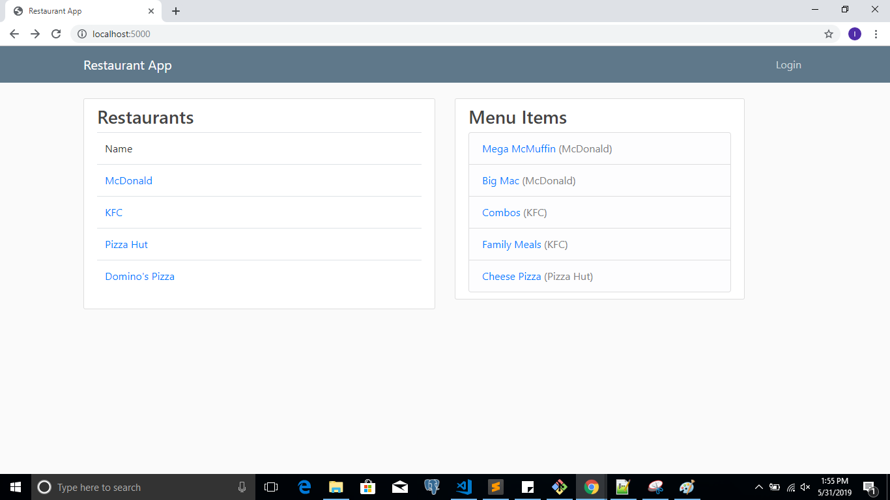
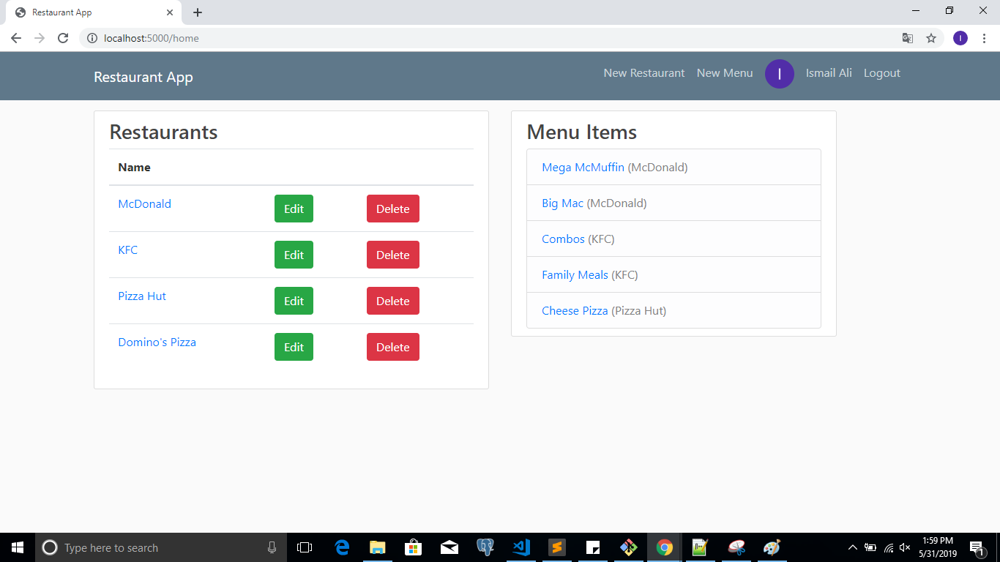
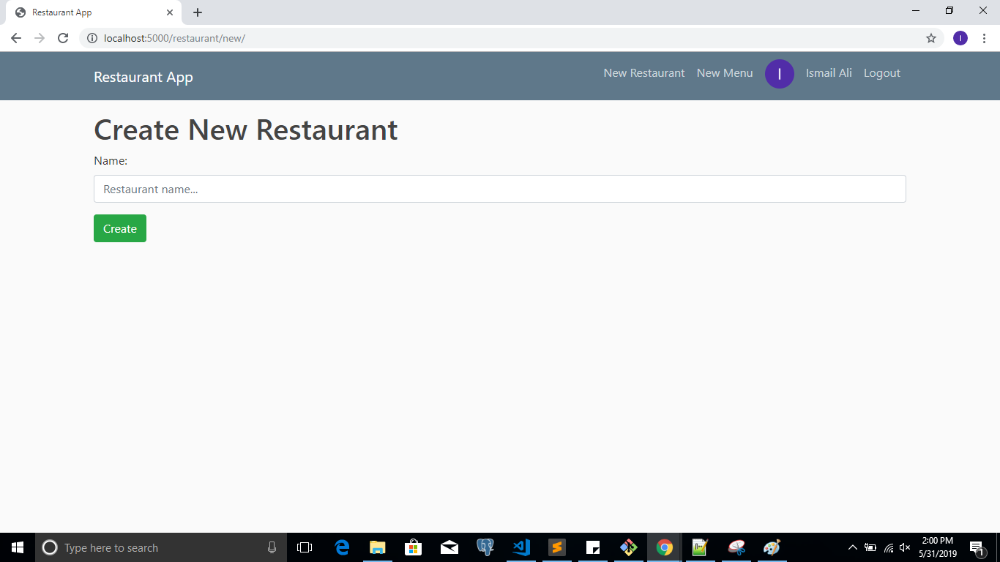
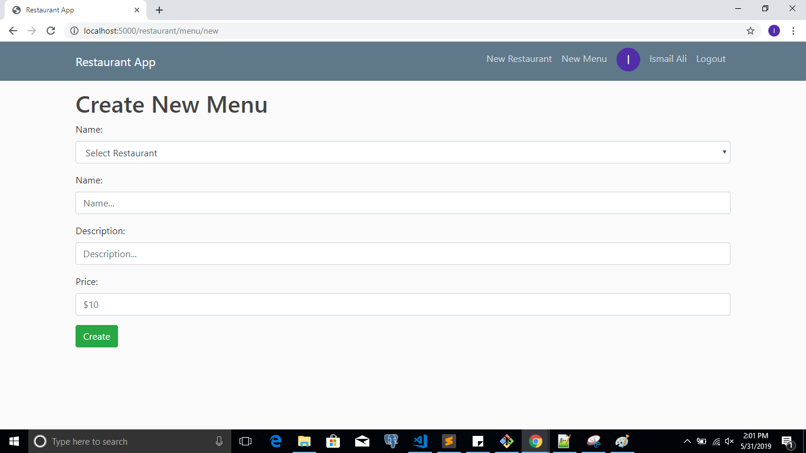
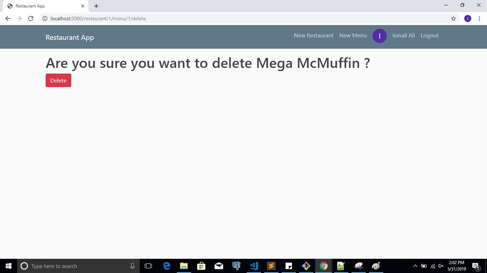

# Project 4: Restaurant App

Python Flask CRUD web with SQLite Databse and Google Sign-In

##  Pages Screenshot

### 1. Create new restaurant page

### 2. Create new Menu Item page

### 3. Delete Menu Item

### 3. JSON View

## How to run

**Step 1:** Download and install Vagrant and VirtualBox

**Step 2:** Configure Virtual Machine

**Step 3:** Launch the Vagrant VM (vagrant up)

**Step 4:** cd /vagrant/catalog 

**Step 5:** python restaurantapp.py 